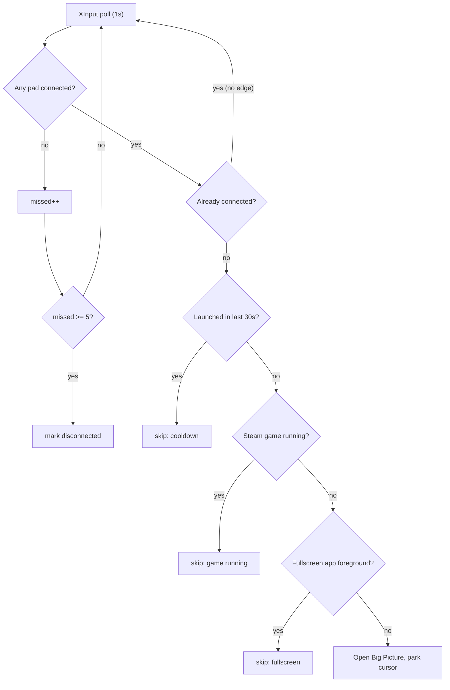

# free-steam-machine

**Turn a controller on. Steam Big Picture opens. Put the controller down and play.**

A tiny background watcher that turns a Windows PC into something that behaves like a
console. No launcher to alt-tab to, no keyboard, no mouse — pick up the pad and the
machine meets you where you are.

> **Windows only.** Must run on native Windows Python — XInput is a host API and is
> invisible from inside WSL.

---

## What it does

- **Opens Big Picture when a controller connects** — Bluetooth, Xbox wireless dongle,
  or USB. It polls XInput, so it doesn't care how the pad arrives.
- **Summons Big Picture on a Guide double-tap** — tap the Xbox button twice, any time,
  whatever is running.
- **Stays out of your way.** It will not throw Big Picture over a game you're playing.
  This is harder than it sounds — see [Not interrupting your game](#not-interrupting-your-game).
- **Wakes the screen** (optional) so a couch PC goes from dark to Big Picture.
- **Warns you before the pad dies**, with a toast that doesn't steal focus.
- **Parks the mouse pointer** out of the way, so there's no cursor sat in the middle
  of your TV.

No third-party packages. The whole thing is the Python standard library and `ctypes`
calls into Win32.

## Why this exists

There's no built-in Steam setting for it. Valve's "Guide button focuses Steam" option
needs Steam already running *and* a manual double-tap, which is most of the work you
were trying to avoid. This closes the gap: the PC reacts to the controller, not the
other way round.

---

## Requirements

- Windows 10 or 11
- [Python for Windows](https://www.python.org/downloads/windows/) 3.8+, installed with
  **"Add python.exe to PATH"** ticked
- Steam (which registers the `steam://` protocol handler)

## Quick start

Try it in the foreground first, so you can see any error:

```powershell
python controller_bigpicture.py
```

Leave it running and turn your controller on. Big Picture should open. `Ctrl+C` to stop.

## Install it properly

Drops a shortcut in your Startup folder that runs the watcher with `pythonw.exe`, so
there's no console window and it starts every time you sign in:

```powershell
powershell -ExecutionPolicy Bypass -File .\install.ps1
```

The installer prints a command to start it immediately without rebooting. Switches are
passed straight through to the watcher:

```powershell
.\install.ps1 -Wake          # wake the display on connect
.\install.ps1 -Wake -Log     # ...and log to %LOCALAPPDATA%
.\install.ps1 -NoGuard       # allow launching over a running game
```

To remove it:

```powershell
powershell -ExecutionPolicy Bypass -File .\uninstall.ps1
```

## Options

| Flag | Effect |
| ---- | ------ |
| _(none)_ | Watch for a **new** connection. A pad already on when the watcher starts is ignored, so rebooting with the controller on won't relaunch Big Picture. |
| `--launch-now` | Also fire if a controller is already connected at start. Use if you usually boot with the pad on. |
| `--wake` | On connect, wake the monitor and dismiss the screensaver. **Cannot** bypass a password/PIN lock — see [Waking the screen](#waking-the-screen---wake). |
| `--no-guard` | Launch even when a game is running or a fullscreen app owns the foreground. |
| `--no-park` | Leave the mouse pointer alone instead of parking it bottom-right. |
| `--log` | Write a timestamped log to `%LOCALAPPDATA%\controller-bigpicture\watcher.log`. Handy for confirming the silent `pythonw` instance is alive. |

---

## Not interrupting your game

This is the part that matters, and the part that's easy to get wrong.

Naively, "did a controller just appear?" looks like a one-line state comparison. It
isn't, because **XInput lies briefly**:

- **Steam Input** hides the physical pad and substitutes a virtual one whenever a game
  launches or changes input config. For a moment, no real controller exists.
- **Wireless pads** drop frames, and idle-power-off then reconnect on the next button
  press.
- **USB re-enumeration** blanks the slot for a fraction of a second.

A watcher that trusts a single failed poll reads every one of these as unplug + replug.
It opens Big Picture on top of your running game, the game loses focus, and it pauses.
Mid-boss. Repeatedly.

So each trigger runs this gauntlet:



**1. Debounce.** A dropout must persist for 5 consecutive polls (~5s) before it counts
as a disconnect. Blips never reset the "connected" latch, so they can't manufacture a
rising edge.

**2. Game guard.** Nothing auto-fires while a Steam game is running, read from
`HKCU\Software\Valve\Steam\RunningAppID`. This is the strongest signal available, and
critically it stays true for a game that is alt-tabbed, minimised, or on another
monitor — cases the foreground checks below would miss entirely.

**3. Fullscreen guard.** Checked two ways, because exclusive-fullscreen and borderless
windowed games report completely differently:

- `SHQueryUserNotificationState` catches D3D fullscreen and presentation mode.
- A window-rect-vs-monitor comparison catches borderless windowed, which often doesn't
  set the notification state at all.

**4. Cooldown.** At most one launch per 30 seconds, whatever the detector claims.

`--wake`'s screensaver keypress is gated on the same principle: it's only injected when
the screensaver is genuinely running or the session has been idle 60s+. Injected input
goes to whichever window has focus, so an ungated keypress is a phantom keystroke
straight into your game.

Pass `--no-guard` to disable guards 2 and 3.

## Summon on demand: Guide double-tap

Double-tap the **Guide** (Xbox) button and Big Picture opens regardless of what's
running. This is an explicit request, so it deliberately bypasses the guards above.

Reading that button is the interesting bit. The Guide button is **masked out** of the
documented `XInputGetState` — Microsoft reserved it for the Game Bar. Getting at it
requires `XInputGetStateEx`, which is exported **by ordinal 100 only**, with no name
and no header entry:

```python
proto = ctypes.WINFUNCTYPE(ctypes.c_uint32, ctypes.c_uint32, ctypes.POINTER(_XInputState))
get_state_ex = proto((100, xinput))   # ordinal lookup
```

Undocumented, but stable since 2007 and present in both `xinput1_3` and `xinput1_4`. On
the ancient `xinput9_1_0` stub it's absent — the watcher logs `guide=unavailable` and
carries on with connect-detection only.

## Battery warning

A toast appears when a wireless pad's battery reaches the bottom bucket. Toasts never
take focus, so it's safe mid-game. Wired pads report no battery and are skipped.

**On the threshold — an honest limitation.** XInput has no battery percentage.
`XInputGetBatteryInformation` reports one of four coarse buckets only:

| Bucket | Constant |
| ------ | -------- |
| Empty | `BATTERY_LEVEL_EMPTY` |
| Low | `BATTERY_LEVEL_LOW` |
| Medium | `BATTERY_LEVEL_MEDIUM` |
| Full | `BATTERY_LEVEL_FULL` |

So "warn me under 10%" is not expressible through this API. The warning fires at
`EMPTY`, the lowest bucket and the closest available meaning of "about to die". Set
`BATTERY_WARN_AT = BATTERY_LEVEL_LOW` for an earlier, chattier warning. A true
percentage would mean parsing raw HID reports from the pad — a much larger job, and out
of scope here.

## Waking the screen (`--wake`)

With `--wake`, the watcher turns the monitor back on and dismisses a running screensaver
the moment the controller connects, so a couch PC goes from dark screen straight to Big
Picture.

**The important limit:** no user-space script can get past the Windows **password / PIN
lock screen**. That's a deliberate security boundary, not an obstacle to route around.
`--wake` only helps when the session is *unlocked underneath* — monitor asleep or
screensaver running. If the PC is genuinely locked, the most it does is light up the
monitor showing the lock screen.

To make a living-room PC go all the way to the desktop hands-free, change the Windows
setting rather than the script:

- **Settings → Accounts → Sign-in options → "If you've been away, when should Windows
  require you to sign in again?" → Never.**
- If a screensaver is set, untick **"On resume, display logon screen"**.
- For a secure auto-unlock that *does* satisfy the lock screen, use **Windows Hello**.
  A controller can't supply a face or fingerprint, but Hello can.

Storing your password to auto-type it is **not** supported here. It's a real security
risk and it defeats the point of the lock.

---

## How it works

XInput exposes four controller slots. The watcher ticks every 50ms — fast enough to
resolve a Guide double-tap — and does the heavier work on a schedule: connection state
once a second, battery once a minute.

On a confirmed transition from "none connected" to "connected", and once the guards
pass, it calls:

```python
os.startfile("steam://open/bigpicture")
```

`os.startfile` uses `ShellExecute`, which respects the `steam://` protocol handler and
starts Steam first if it isn't running. (`webbrowser.open` would try to hand a non-HTTP
URL to a browser.)

One Win32 detail worth flagging for anyone reading the source: window handles are
**pointer-sized**. `ctypes` assumes a C `int` return unless told otherwise, which
silently truncates every `HWND` on 64-bit and makes handle comparisons meaningless. The
signatures are declared explicitly in `user32()` for exactly this reason.

## Troubleshooting

- **Nothing happens when I run it.** Confirm you're on native Windows Python, not WSL:
  `python -c "import os; print(os.name)"` must print `nt`.
- **`No XInput DLL found`.** Very old Windows only. `xinput1_3` ships with the DirectX
  End-User Runtime; install that and retry.
- **Big Picture doesn't open, but there's no error.** Check the URL works at all: paste
  `steam://open/bigpicture` into Win+R. If that does nothing, the problem is Steam's
  protocol handler, not this script.
- **It opens Big Picture on every reboot.** You're probably passing `--launch-now`, or
  your pad reports connected at login. Drop the flag — the default already ignores an
  already-on pad.
- **It fired while I was playing.** Run with `--log` and check
  `%LOCALAPPDATA%\controller-bigpicture\watcher.log`. Every skip is logged with its
  reason (`cooldown`, `Steam game running`, `fullscreen app in foreground`), so the log
  will tell you which guard should have caught it.
- **Guide double-tap does nothing.** Check the startup line in the log for
  `guide=unavailable`, meaning only `xinput9_1_0` is present and ordinal 100 is missing.
- **`--wake` lights the monitor but I still see the lock screen.** Expected when the
  session requires a password/PIN. See [Waking the screen](#waking-the-screen---wake).

## Use it from your iPhone

iOS can't run a background watcher and has no Big Picture of its own, so the Windows
behaviour doesn't port directly. Two setups do work — full steps in
[ios/README.md](ios/README.md):

1. **Controller connects to iPhone → open a game app** (e.g. Steam Link to stream your
   PC). A Shortcuts *Bluetooth* automation, no code required.
2. **iPhone as a remote** that opens Big Picture on the PC, using the included
   `bigpicture_server.py`:

   ```powershell
   python bigpicture_server.py                  # http://<pc-ip>:8765/bigpicture
   python bigpicture_server.py --token mysecret # require ?token=mysecret
   ```

   An iPhone Home Screen shortcut then hits that URL over your LAN. It's LAN-only with
   a shared token at best — don't expose it to the internet.

## Not on Windows?

- **Steam Deck / SteamOS** already boots into Gamepad UI. You don't need this.
- **macOS / Linux desktop** use different controller APIs (IOKit / evdev), so detection
  would need rewriting. Open an issue and say which.

## License

MIT — see [LICENSE](LICENSE).
