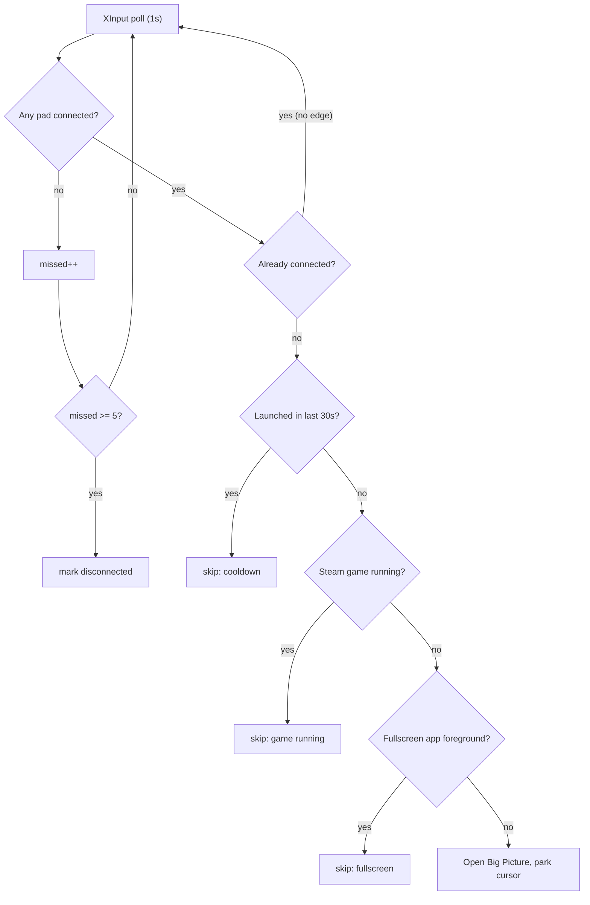

<div align="center">

# free-steam-machine

### The Steam Machine experience, on the PC you already own.

Turn a controller on. Big Picture opens. That's the whole thing.

<br>

[](https://www.microsoft.com/windows)
[](https://www.python.org/downloads/windows/)
[](https://store.steampowered.com/)

[](#requirements)
[](LICENSE)
[](https://github.com/GoodAnalysis/free-steam-machine/commits/main)
[](https://github.com/GoodAnalysis/free-steam-machine)
[](https://github.com/GoodAnalysis/free-steam-machine/stargazers)

</div>

<br>

## Why I built this

I was annoyed at RAM prices.

That's genuinely the whole origin story. I'd been speccing up a living room box, watching memory
prices do what they've been doing, and I got to somewhere around £1500 before I stopped and asked
myself what I was actually buying. A machine whose entire job is to sit under the telly and be in
Big Picture when I pick up a controller.

I already own a PC that can do that. It's four feet away. It just doesn't *know* it's supposed to.

So I sat down and worked out what the console experience actually consists of, and it turns out
it's smaller than you'd think. You turn a pad on and the thing wakes up in a controller UI. You put
the pad down and it gets out of the way. That's the product. Everything else is a case and a
graphics card I've already got.

This is that behaviour, in about 600 lines of Python, using nothing but the standard library. It
cost me a weekend and no money at all.

```console
$ python controller_bigpicture.py --wake --log

23:42:46  watching (wake=True, guard=True, park=True, guide=yes, seeded connected=False)
23:51:02  controller connected -> waking + opening Big Picture
23:58:31  controller disconnected (confirmed after 5 polls)
00:04:17  controller connected -> skipped (Steam game running (appid 2322010))
00:19:55  guide double-tap -> opening Big Picture
```

> [!IMPORTANT]
> Windows only. It has to run on native Windows Python, because XInput is a host API and WSL can't
> see it.

<br>

## Contents

- [What it does](#what-it-does) · [Requirements](#requirements) · [Quick start](#quick-start) · [Install it properly](#install-it-properly) · [Options](#options)
- [Not interrupting your game](#not-interrupting-your-game)
- [Guide double-tap](#summon-on-demand-guide-double-tap) · [Battery warning](#battery-warning) · [Waking the screen](#waking-the-screen---wake)
- [How it works](#how-it-works) · [Troubleshooting](#troubleshooting) · [iPhone](#use-it-from-your-iphone) · [Other platforms](#not-on-windows)

---

## What it does

| | |
| --- | --- |
| **Opens Big Picture on connect** | Bluetooth, the Xbox dongle, or USB. It watches XInput, so it doesn't care how the pad turns up. |
| **Guide double-tap** | Two taps of the Xbox button and you're in Big Picture, whenever you like. |
| **Leaves running games alone** | It won't drop Big Picture on top of something you're playing. This took most of the effort. [Here's why](#not-interrupting-your-game). |
| **Wakes the screen** | Optional. Dark screen to Big Picture without touching anything. |
| **Warns on low battery** | A toast, so it won't steal focus mid-game. |
| **Parks the mouse pointer** | Shoves the cursor into a corner instead of leaving it floating in the middle of the telly. |

No pip install, no dependencies. Standard library and some `ctypes` calls into Win32.

Steam has no setting for any of this, incidentally. The closest thing is "Guide button focuses
Steam", which needs Steam already running and still makes you press the button yourself, which is
the bit I was trying to avoid.

## Requirements

- Windows 10 or 11
- [Python for Windows](https://www.python.org/downloads/windows/) 3.8+, with "Add python.exe to PATH" ticked
- Steam, which is what registers the `steam://` protocol handler

## Quick start

Run it in the foreground first so you can see anything that goes wrong:

```powershell
python controller_bigpicture.py
```

Leave that running, turn your controller on, and Big Picture should open. <kbd>Ctrl</kbd>+<kbd>C</kbd> stops it.

## Install it properly

This puts a shortcut in your Startup folder that runs the watcher under `pythonw.exe`. No console
window, and it comes back every time you sign in:

```powershell
powershell -ExecutionPolicy Bypass -File .\install.ps1
```

It'll print a command to start it straight away so you don't have to reboot. Switches get passed
through:

```powershell
.\install.ps1 -Wake          # wake the display on connect
.\install.ps1 -Wake -Log     # and log to %LOCALAPPDATA%
.\install.ps1 -NoGuard       # let it launch over a running game
```

Removing it:

```powershell
powershell -ExecutionPolicy Bypass -File .\uninstall.ps1
```

## Options

| Flag | Effect |
| ---- | ------ |
| _(none)_ | Watch for a new connection. A pad that's already on when the watcher starts gets ignored, so rebooting with the controller on won't relaunch Big Picture. |
| `--launch-now` | Fire even if a controller is already connected at startup. Handy if you tend to boot with the pad on. |
| `--wake` | Wake the monitor and dismiss the screensaver on connect. Can't get past a password or PIN. See [Waking the screen](#waking-the-screen---wake). |
| `--no-guard` | Launch even when a game is running or something's fullscreen. |
| `--no-park` | Leave the mouse pointer alone. |
| `--log` | Timestamped log at `%LOCALAPPDATA%\controller-bigpicture\watcher.log`. Mostly useful for checking the silent `pythonw` instance is still alive. |

---

## Not interrupting your game

This is where the actual work went, and it's not where I expected it to go.

"Has a controller just appeared?" reads like a one-line comparison against the last known state.
Write that, though, and you'll find Big Picture landing on top of your game every twenty minutes for
no visible reason. It'll pause, because it lost focus. Usually at the worst possible moment.

The reason is that XInput reports disconnects when nothing has been unplugged:

- Steam Input hides your real pad and swaps in a virtual one when a game launches or changes its input config. For a moment there's genuinely no controller attached.
- Wireless pads drop frames. They also power down when idle and come back on the next button press, which looks identical to someone plugging one in.
- USB re-enumeration blanks the slot for a fraction of a second.

Trust a single failed poll and every one of those reads as unplug-then-replug.

So there are four checks between "a controller appeared" and actually opening anything:



**1. Debounce.** A dropout has to survive five polls in a row, so roughly five seconds, before it
counts. Short blips never clear the "connected" latch, which means they can't produce a rising edge
to trigger on.

**2. Game guard.** Nothing fires automatically while a Steam game is running. That comes from
`HKCU\Software\Valve\Steam\RunningAppID`. I use the registry rather than looking at windows because
it stays set when a game is alt-tabbed, minimised, or sat on another monitor, and the foreground
checks below miss all three.

**3. Fullscreen guard.** Two separate checks, because exclusive-fullscreen and borderless windowed
games don't report themselves the same way at all:

- `SHQueryUserNotificationState` picks up D3D fullscreen and presentation mode.
- Comparing the foreground window's rect against its monitor picks up borderless windowed, which frequently doesn't set the notification state.

**4. Cooldown.** One launch per thirty seconds, no matter what the detector reckons.

The screensaver keypress behind `--wake` is gated on the same principle. It only gets injected if
the screensaver is actually running or the session's been idle a minute. Injected input goes
wherever the focus is, so an ungated keypress ends up in your game.

> [!TIP]
> `--no-guard` turns off guards 2 and 3 if you want it to barge in regardless.

## Summon on demand: Guide double-tap

Double-tap the Guide button and Big Picture opens, whatever's happening. You asked for that
explicitly, so it skips every guard above.

Getting at that button is more annoying than it should be. Microsoft masked the Guide button out of
the documented `XInputGetState` and kept it for the Game Bar. The only way to read it is
`XInputGetStateEx`, which is exported by ordinal 100 and has no name and no header entry:

```python
proto = ctypes.WINFUNCTYPE(ctypes.c_uint32, ctypes.c_uint32, ctypes.POINTER(_XInputState))
get_state_ex = proto((100, xinput))   # ordinal lookup
```

Undocumented, but it's been sat there unchanged since 2007 and it's in both `xinput1_3` and
`xinput1_4`. The ancient `xinput9_1_0` stub doesn't have it, and if that's all you've got the
watcher logs `guide=unavailable` and carries on doing connect detection only.

> [!NOTE]
> Windows binds Guide to Xbox Game Bar out of the box, so a double-tap may well open both.
> Settings, then Gaming, then Xbox Game Bar turns that off.

## Battery warning

You get a toast when a wireless pad hits the bottom of its battery range. Toasts don't take focus,
so it's safe mid-game. Wired pads report no battery at all and get skipped.

> [!IMPORTANT]
> XInput has no battery percentage. `XInputGetBatteryInformation` gives you one of four buckets
> (`EMPTY`, `LOW`, `MEDIUM`, `FULL`) and that's your lot, so "warn me under 10%" isn't something
> this API can express.

I've got it firing on `EMPTY`, the lowest bucket. If you'd rather have more notice, set
`BATTERY_WARN_AT` to `BATTERY_LEVEL_LOW`, though it'll nag you more. Real percentages would mean
parsing raw HID reports off the pad, and I wasn't going down that road for this.

## Waking the screen (`--wake`)

With `--wake` the watcher turns the monitor back on and kills the screensaver when a controller
connects, so the thing goes from dark to Big Picture on its own.

> [!CAUTION]
> Nothing running in user space gets past the Windows password or PIN screen, and this doesn't try.
> `--wake` only helps when the session is already unlocked underneath, with the monitor asleep or a
> screensaver up. If the machine is properly locked, all you'll get is a lit monitor showing you the
> lock screen.

If you want a living room PC to go all the way to the desktop on its own, change Windows rather than
the script:

- Settings > Accounts > Sign-in options > "If you've been away, when should Windows require you to sign in again?" > Never.
- If you run a screensaver, untick "On resume, display logon screen".
- Windows Hello will satisfy the lock screen properly. A controller can't give it a face or a fingerprint, but you can.

I haven't built anything that stores your password and types it in for you. That defeats the point
of having a lock.

---

## How it works

XInput gives you four controller slots. The watcher ticks every 50ms, which is quick enough to catch
a Guide double-tap, and does the expensive things on a slower schedule: connection state once a
second, battery once a minute.

When a "nothing connected" to "connected" transition survives the guards, it calls this:

```python
os.startfile("steam://open/bigpicture")
```

`os.startfile` goes through `ShellExecute`, which respects the `steam://` handler and will start
Steam first if it isn't running. `webbrowser.open` won't do, since it tries to hand non-HTTP URLs to
a browser.

<details>
<summary><b>A Win32 gotcha, if you're reading the source</b></summary>

<br>

Window handles are pointer-sized. `ctypes` assumes a C `int` return unless you tell it otherwise,
which quietly truncates every `HWND` on 64-bit. Nothing throws. Your handle comparisons just stop
matching things and you spend an hour wondering why the fullscreen check never fires. Hence the
explicit signatures in `user32()`:

```python
u.GetForegroundWindow.restype = ctypes.c_void_p
u.GetShellWindow.restype      = ctypes.c_void_p
u.MonitorFromWindow.restype   = ctypes.c_void_p
```

</details>

## Troubleshooting

<details>
<summary><b>Nothing happens when I run it</b></summary><br>

Make sure you're on native Windows Python and not WSL:

```powershell
python -c "import os; print(os.name)"   # needs to print: nt
```
</details>

<details>
<summary><b><code>No XInput DLL found</code></b></summary><br>

Very old Windows only. `xinput1_3` comes with the DirectX End-User Runtime, so install that and try
again.
</details>

<details>
<summary><b>Big Picture doesn't open and there's no error</b></summary><br>

Check the URL works on its own. Paste `steam://open/bigpicture` into <kbd>Win</kbd>+<kbd>R</kbd>. If
that does nothing then it's Steam's protocol handler at fault, not this.
</details>

<details>
<summary><b>It opens Big Picture on every reboot</b></summary><br>

You're probably passing `--launch-now`, or your pad is reporting itself connected at login. Drop the
flag. The default already ignores a pad that's on when the watcher starts.
</details>

<details>
<summary><b>It fired while I was playing</b></summary><br>

Run with `--log` and have a look at `%LOCALAPPDATA%\controller-bigpicture\watcher.log`. Every skip
gets logged with its reason, so you can see which guard should have caught it:

```
controller connected -> skipped (cooldown)
controller connected -> skipped (Steam game running (appid 2322010))
controller connected -> skipped (fullscreen app in foreground)
```
</details>

<details>
<summary><b>Guide double-tap does nothing</b></summary><br>

Look at the startup line in the log for `guide=unavailable`. That means you've only got
`xinput9_1_0` and ordinal 100 isn't there.
</details>

<details>
<summary><b><code>--wake</code> lights the monitor but I still get the lock screen</b></summary><br>

That's expected if the session wants a password or PIN. See
[Waking the screen](#waking-the-screen---wake).
</details>

## Use it from your iPhone

iOS can't run a background watcher and hasn't got a Big Picture of its own, so none of this ports
over directly. Two things do work, and there are full steps in [ios/README.md](ios/README.md):

1. The controller connects to the iPhone and opens a game app, Steam Link for instance, to stream from your PC. That's a Shortcuts Bluetooth automation and needs no code at all.
2. The iPhone works as a remote that opens Big Picture on the PC, using `bigpicture_server.py`:

   ```powershell
   python bigpicture_server.py                  # http://<pc-ip>:8765/bigpicture
   python bigpicture_server.py --token mysecret # require ?token=mysecret
   ```

   Then a Home Screen shortcut hits that URL over your LAN.

> [!CAUTION]
> That server has a shared token at best. Keep it on your LAN and don't put it on the internet.

## Not on Windows?

| Platform | Status |
| -------- | ------ |
| Steam Deck / SteamOS | Boots into Gamepad UI already. You don't need this. |
| macOS / Linux desktop | Different controller APIs, IOKit and evdev, so the detection would need rewriting. Open an issue and tell me which one. |

---

<div align="center">

MIT. See [LICENSE](LICENSE).

</div>
