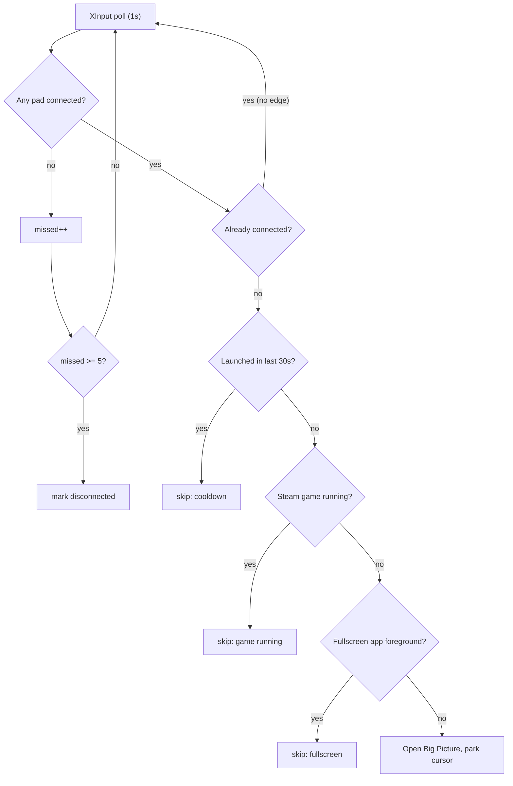

<div align="center">

# free-steam-machine

### Turn a controller on and Steam Big Picture opens.

A small background watcher that lets a Windows PC start a game without a keyboard or mouse.

<br>

[](https://www.microsoft.com/windows)
[](https://www.python.org/downloads/windows/)
[](https://store.steampowered.com/)

[](#requirements)
[](LICENSE)
[](https://github.com/GoodAnalysis/free-steam-machine/commits/main)
[](https://github.com/GoodAnalysis/free-steam-machine)
[](https://github.com/GoodAnalysis/free-steam-machine/stargazers)

</div>

<br>

```console
$ python controller_bigpicture.py --wake --log

23:42:46  watching (wake=True, guard=True, park=True, guide=yes, seeded connected=False)
23:51:02  controller connected -> waking + opening Big Picture
23:58:31  controller disconnected (confirmed after 5 polls)
00:04:17  controller connected -> skipped (Steam game running (appid 2322010))
00:19:55  guide double-tap -> opening Big Picture
```

> [!IMPORTANT]
> Windows only. It must run on native Windows Python, because XInput is a host API and is invisible from inside WSL.

<br>

## Contents

- [What it does](#what-it-does) · [Why this exists](#why-this-exists)
- [Requirements](#requirements) · [Quick start](#quick-start) · [Install it properly](#install-it-properly) · [Options](#options)
- [Not interrupting your game](#not-interrupting-your-game)
- [Guide double-tap](#summon-on-demand-guide-double-tap) · [Battery warning](#battery-warning) · [Waking the screen](#waking-the-screen---wake)
- [How it works](#how-it-works) · [Troubleshooting](#troubleshooting) · [iPhone](#use-it-from-your-iphone) · [Other platforms](#not-on-windows)

---

## What it does

| | |
| --- | --- |
| **Opens Big Picture on connect** | Works over Bluetooth, the Xbox wireless dongle, or USB. It polls XInput, so it doesn't care how the pad arrives. |
| **Guide double-tap** | Tap the Xbox button twice to open Big Picture at any time. |
| **Leaves running games alone** | It won't open Big Picture over a game you're playing. See [Not interrupting your game](#not-interrupting-your-game). |
| **Wakes the screen** | Optional, so a couch PC goes from a dark screen to Big Picture. |
| **Warns on low battery** | A toast notification, which doesn't steal focus from a game. |
| **Parks the mouse pointer** | Moves the cursor to the corner instead of leaving it in the middle of the TV. |

No third-party packages. It uses the Python standard library and `ctypes` calls into Win32.

## Why this exists

Steam has no setting for this. The closest thing, "Guide button focuses Steam", needs Steam already
running and still requires you to press the button yourself.

## Requirements

- Windows 10 or 11
- [Python for Windows](https://www.python.org/downloads/windows/) 3.8+, installed with "Add python.exe to PATH" ticked
- Steam, which registers the `steam://` protocol handler

## Quick start

Run it in the foreground first so you can see any errors:

```powershell
python controller_bigpicture.py
```

Leave it running and turn your controller on. Big Picture should open. Press <kbd>Ctrl</kbd>+<kbd>C</kbd> to stop.

## Install it properly

This drops a shortcut in your Startup folder that runs the watcher with `pythonw.exe`, so there's no
console window and it starts whenever you sign in:

```powershell
powershell -ExecutionPolicy Bypass -File .\install.ps1
```

The installer prints a command to start it immediately without rebooting. Switches are passed
through to the watcher:

```powershell
.\install.ps1 -Wake          # wake the display on connect
.\install.ps1 -Wake -Log     # also log to %LOCALAPPDATA%
.\install.ps1 -NoGuard       # allow launching over a running game
```

To remove it:

```powershell
powershell -ExecutionPolicy Bypass -File .\uninstall.ps1
```

## Options

| Flag | Effect |
| ---- | ------ |
| _(none)_ | Watch for a new connection. A pad that is already on when the watcher starts is ignored, so rebooting with the controller on won't relaunch Big Picture. |
| `--launch-now` | Also fire if a controller is already connected at start. Useful if you tend to boot with the pad on. |
| `--wake` | On connect, wake the monitor and dismiss the screensaver. This cannot bypass a password or PIN lock. See [Waking the screen](#waking-the-screen---wake). |
| `--no-guard` | Launch even when a game is running or a fullscreen app owns the foreground. |
| `--no-park` | Leave the mouse pointer where it is. |
| `--log` | Write a timestamped log to `%LOCALAPPDATA%\controller-bigpicture\watcher.log`. Useful for checking the silent `pythonw` instance is alive. |

---

## Not interrupting your game

"Did a controller just appear?" looks like a one-line state comparison, but XInput reports a
disconnect fairly often when nothing has actually been unplugged:

- Steam Input hides the physical pad and substitutes a virtual one when a game launches or changes its input config, so for a moment no real controller exists.
- Wireless pads drop frames, and they power off when idle then reconnect on the next button press.
- USB re-enumeration blanks the slot for a fraction of a second.

If a single failed poll counts as a disconnect, all of these look like an unplug followed by a
replug. Big Picture then opens on top of whatever you're playing, the game loses focus, and it
pauses.

Each trigger therefore has to get past four checks:



**1. Debounce.** A dropout has to persist for 5 consecutive polls, about 5 seconds, before it counts
as a disconnect. Short blips never reset the "connected" latch, so they can't produce a rising edge.

**2. Game guard.** Nothing fires automatically while a Steam game is running. This is read from
`HKCU\Software\Valve\Steam\RunningAppID`, which stays set for a game that is alt-tabbed, minimised
or on another monitor. The foreground checks below would miss all three cases.

**3. Fullscreen guard.** Checked two ways, because exclusive-fullscreen and borderless windowed
games report differently:

- `SHQueryUserNotificationState` catches D3D fullscreen and presentation mode.
- A comparison of the foreground window's rect against its monitor catches borderless windowed, which often doesn't set the notification state.

**4. Cooldown.** One launch per 30 seconds at most.

The screensaver keypress used by `--wake` is gated the same way. It is only injected when the
screensaver is running or the session has been idle for 60 seconds or more. Injected input goes to
whichever window has focus, so an ungated keypress would land in your game.

> [!TIP]
> Pass `--no-guard` to disable guards 2 and 3.

## Summon on demand: Guide double-tap

Double-tap the Guide (Xbox) button and Big Picture opens regardless of what's running. You asked for
it explicitly, so it skips the guards above.

Reading that button takes some work. The Guide button is masked out of the documented
`XInputGetState`, since Microsoft reserved it for the Game Bar. Getting at it requires
`XInputGetStateEx`, which is exported by ordinal 100 only, with no name and no header entry:

```python
proto = ctypes.WINFUNCTYPE(ctypes.c_uint32, ctypes.c_uint32, ctypes.POINTER(_XInputState))
get_state_ex = proto((100, xinput))   # ordinal lookup
```

It's undocumented but has been stable since 2007, and is present in both `xinput1_3` and
`xinput1_4`. It's missing from the older `xinput9_1_0` stub, in which case the watcher logs
`guide=unavailable` and carries on with connect-detection only.

> [!NOTE]
> Windows binds the Guide button to Xbox Game Bar by default, so a double-tap may open both. You can
> turn that off in Settings > Gaming > Xbox Game Bar.

## Battery warning

A toast appears when a wireless pad's battery reaches the bottom bucket. Toasts don't take focus, so
this is safe during a game. Wired pads report no battery and are skipped.

> [!IMPORTANT]
> XInput has no battery percentage. `XInputGetBatteryInformation` reports one of four coarse buckets
> (`EMPTY`, `LOW`, `MEDIUM`, `FULL`), so a threshold like "warn me under 10%" can't be expressed
> through this API.

The warning fires at `EMPTY`, the lowest bucket. Set `BATTERY_WARN_AT` to `BATTERY_LEVEL_LOW` if you
want an earlier and more frequent warning. Getting a real percentage would mean parsing raw HID
reports from the pad, which is out of scope here.

## Waking the screen (`--wake`)

With `--wake`, the watcher turns the monitor back on and dismisses a running screensaver when the
controller connects, so a couch PC goes straight to Big Picture.

> [!CAUTION]
> No user-space script can get past the Windows password or PIN lock screen, and this one doesn't
> try. `--wake` only helps when the session is unlocked underneath, with the monitor asleep or a
> screensaver running. If the PC is locked, all it does is light up the monitor showing the lock
> screen.

To make a living-room PC reach the desktop hands-free, change the Windows setting rather than the
script:

- Settings > Accounts > Sign-in options > "If you've been away, when should Windows require you to sign in again?" > Never.
- If a screensaver is set, untick "On resume, display logon screen".
- Windows Hello will satisfy the lock screen securely. A controller can't supply a face or fingerprint, but Hello can.

Storing your password to auto-type it isn't supported here, because it defeats the point of having
the lock.

---

## How it works

XInput exposes four controller slots. The watcher ticks every 50ms, which is fast enough to resolve
a Guide double-tap, and does the heavier work on a schedule: connection state once a second, battery
once a minute.

Once a transition from "none connected" to "connected" is confirmed and the guards pass, it calls:

```python
os.startfile("steam://open/bigpicture")
```

`os.startfile` uses `ShellExecute`, which respects the `steam://` protocol handler and starts Steam
first if it isn't running. `webbrowser.open` would try to hand a non-HTTP URL to a browser instead.

<details>
<summary><b>A Win32 gotcha worth knowing if you read the source</b></summary>

<br>

Window handles are pointer-sized. `ctypes` assumes a C `int` return unless told otherwise, which
truncates every `HWND` on 64-bit and makes handle comparisons meaningless. Nothing errors; the
comparisons just stop matching. The signatures are declared explicitly in `user32()` to avoid this:

```python
u.GetForegroundWindow.restype = ctypes.c_void_p
u.GetShellWindow.restype      = ctypes.c_void_p
u.MonitorFromWindow.restype   = ctypes.c_void_p
```

</details>

## Troubleshooting

<details>
<summary><b>Nothing happens when I run it</b></summary><br>

Check you're on native Windows Python rather than WSL:

```powershell
python -c "import os; print(os.name)"   # must print: nt
```
</details>

<details>
<summary><b><code>No XInput DLL found</code></b></summary><br>

This affects very old Windows only. `xinput1_3` ships with the DirectX End-User Runtime, so install
that and retry.
</details>

<details>
<summary><b>Big Picture doesn't open, but there's no error</b></summary><br>

Check the URL works at all by pasting `steam://open/bigpicture` into <kbd>Win</kbd>+<kbd>R</kbd>. If
nothing happens, the problem is Steam's protocol handler rather than this script.
</details>

<details>
<summary><b>It opens Big Picture on every reboot</b></summary><br>

You're probably passing `--launch-now`, or your pad reports connected at login. Drop the flag, since
the default already ignores a pad that's already on.
</details>

<details>
<summary><b>It fired while I was playing</b></summary><br>

Run with `--log` and check `%LOCALAPPDATA%\controller-bigpicture\watcher.log`. Every skip is logged
with a reason, so the log will show which guard should have caught it:

```
controller connected -> skipped (cooldown)
controller connected -> skipped (Steam game running (appid 2322010))
controller connected -> skipped (fullscreen app in foreground)
```
</details>

<details>
<summary><b>Guide double-tap does nothing</b></summary><br>

Check the startup line in the log for `guide=unavailable`, which means only `xinput9_1_0` is present
and ordinal 100 is missing.
</details>

<details>
<summary><b><code>--wake</code> lights the monitor but I still see the lock screen</b></summary><br>

That's expected when the session requires a password or PIN. See
[Waking the screen](#waking-the-screen---wake).
</details>

## Use it from your iPhone

iOS can't run a background watcher and has no Big Picture of its own, so this doesn't port directly.
Two setups do work, with full steps in [ios/README.md](ios/README.md):

1. Controller connects to the iPhone and opens a game app, for example Steam Link to stream your PC. This is a Shortcuts Bluetooth automation and needs no code.
2. The iPhone acts as a remote that opens Big Picture on the PC, using the included `bigpicture_server.py`:

   ```powershell
   python bigpicture_server.py                  # http://<pc-ip>:8765/bigpicture
   python bigpicture_server.py --token mysecret # require ?token=mysecret
   ```

   An iPhone Home Screen shortcut then hits that URL over your LAN.

> [!CAUTION]
> The LAN server has a shared token at best. Don't expose it to the internet.

## Not on Windows?

| Platform | Status |
| -------- | ------ |
| Steam Deck / SteamOS | Already boots into Gamepad UI, so you don't need this. |
| macOS / Linux desktop | These use different controller APIs (IOKit and evdev), so detection would need rewriting. Open an issue and say which. |

---

<div align="center">

MIT. See [LICENSE](LICENSE).

</div>
